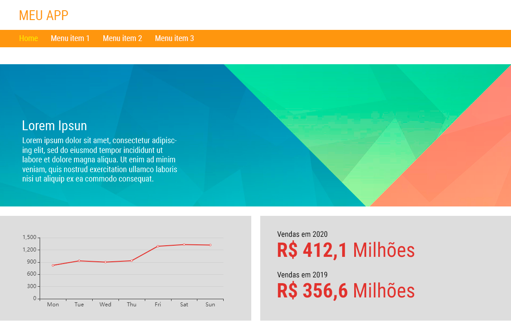

# TESTE ESTÁGIO FRONT-END

[Link para acesso](https://teste-cluster-franco-moraes.netlify.app/)

Você deverá montar o layout da página abaixo.

  
## Desenvolvimento:
Para o desenvolvimento, poderão ser utilizadas tecnologias web: HTML, CSS, JS ou outra(s). 

## Entrega: 
A entrega deverá ser realizada através do envio de um .ZIP contendo os arquivos referentes ao teste, no prazo informado por email.

## Observações:

1)	Fonte

- Todas as fontes são "Roboto Condensed" (baixar do Google Fonts)

2)	Mobile

- São considerados mobile dispositivos que possuam telas com largura menor que 480px.
- A tela mobile deverá empilhar os conteúdos, ou seja, as colunas deverão virar linhas.
- O menu deverá estar escondido, podendo ser aberto com um botão 'hamburger'.
- O menu deverá ser aberto da esquerda para a direita. O layout do menu é de livre criação pelo candidato, desde que corresponda aos itens do menu desktop.

3)	Gráfico de linha

- Utilizar a biblioteca Echarts para a renderização do gráfico de linha. Documentação: https://echarts.apache.org/en/tutorial.html#Get%20Started%20with%20ECharts%20in%205%20minutes

Imagem de apoio para utilizar no primeiro conteúdo:

 ---

## Autor

Franco Moraes  
 [GitHub](https://github.com/francomoraes)  
 [LinkedIn](https://www.linkedin.com/in/francomoraes/)
